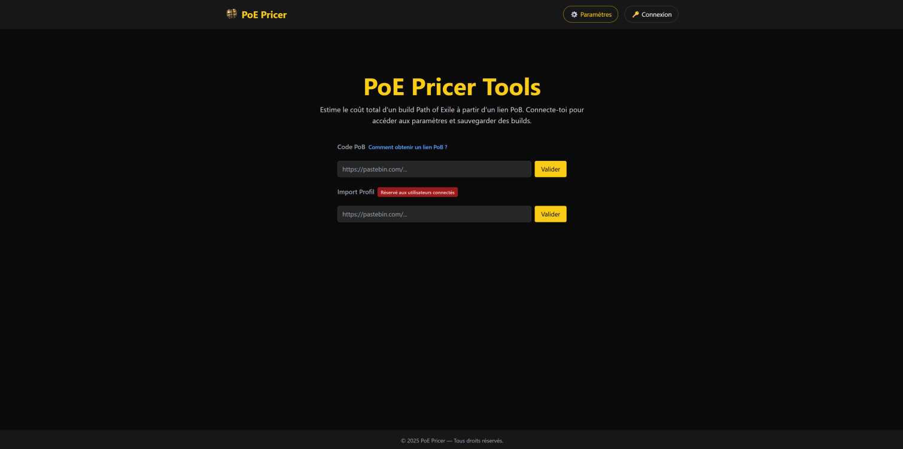
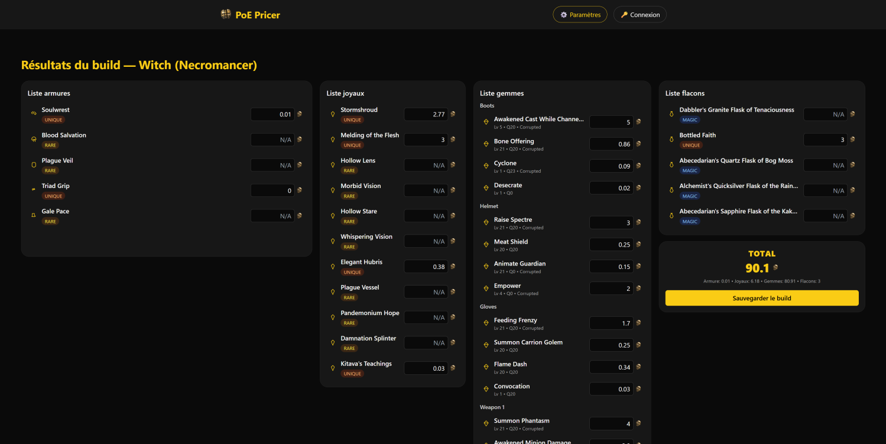

# POE Pricer
Project to create a web application to price full build from Path of Exile.

## SUMMARYS
1. [Context](#1-Context)
2. [Current state of the project](#2-Current-state-of-the-project)
3. [Future of the project](#3-Future-of-the-project)
4. [Documentation](#4-Documentation)
5. [Credits](#5-Credits)

## 1. Context
This project is born out of the idea that pricing a full build could be useful to PoE players, taking into account all items buyable in the build and totaling the price automatically.

With this idea, the proposed format of application would be a web application that would permit the core features :
- Import a build from a Path of Building (PoB) link, pobb.in or other format of build sharing
- Load the build with a graphique interface that shows items of the build
- Display price of each item in correspondence with option selected (League, Softcore or Hardcore, a specific date, ...etc )
- Connect to an account with your PoE account
  - Save your build with configuration to look at later
  - Import a build from your account or another account with secure use of the POESESSID.
- Get general price and market data linked to your loaded build

## 2. Current state of the project
### What is done
Currently, the project only has a functional demo, work by launching a first local server from the python/django backend/ folder and a second local server from the React frontend/ folder

Features currently implemented :
1. A webpage to input a PoB code
2. Loading a PoB code and decoding it to an XML
3. Transforming the XML to a JSON file readable in the frontend
4. Fetching price of the different items of the build from poe.ninja website API
5. Graphically displaying items and their price in the webpage 

### What it currently looks like
The main page, allows you to load a build with a Pob code (other functionalities shown here are not currently fully implemented):

The page that display the build :

### Current limitation
- Visually laking, not at the level of other displaying build apps from the community.
- Princing of a build with current price from Standard League. No access to other current league or past league.
  - Pricable item are only Uniques and Gems.
- Weapon slot 1 and Weapon slot 2 get mistaken sometimes when PoB code is read, especially when dual-wielding.
- A lot of specific cases are not read correctly by the app and some niche stats on item sometime are not taken into account for display (ex: Crucible Tree, Tattoo, Foil version...etc.
- Some data are inferred when taken from PoB link and are not either sure to be correct or are just not calculable (ex: corruption of gems is inferrable for some, other it is just impossible to know from code).
- Lack core features.

## 3. Future of the project
Current project is only a demo, it has a lot of marge to improve. In this sense, working toward the development of the different core features are the obvious step.

### First, short-term goals are :
- Making the app more visually appealing (by maybe finding a more interesting/unique style ?)
- Making the code more readable and maintainable with better code etiquette and proper care for separation of responsibility in the different scripts.
- Do more testing to identify limitation of parsing of data from PoB code, and try to find cases that are not parsed correctly.

### Long-term goal, or the core features are :
- Use other data from poe.ninja API to access other league current league price.
- Use data from poe.ninja archive to access price of items from past league.
- Create an account with your PoE account to save your build with configuration to look at later.
  - With usage of Authentification to secure connection.
  - Create a Database to stock USer and Build data.
- Extract a build from an account name and character name (require POESESSID cookie from a connected account)
- Add the possibility price magic or rare items by making a direct request to PoE Trade website.

## 4. Documentation
Documentation is located in **_docs/_** folder.\
You'll find a lot of information no here there (Detail on backend and frontend, instruction on launching server, conception details, ...etc)

It can contain some general information about the project + specific information to backend and frontend in their respective folders (**_docs/backend/_** and **_docs/frontend/_**).

## 5. Credits
The Project was founded by [Erico Labare](https://github.com/Erico-Labare) and [MeTuseL](https://github.com/MeTuseL).

We thank Grinding Gear Games for their [game](https://www.pathofexile.com/) and for freely sharing their API to fetch market data.
In the same way, we thank [poe.ninja](https://poe.ninja/) for the data they provide with their own API and their work in general.

